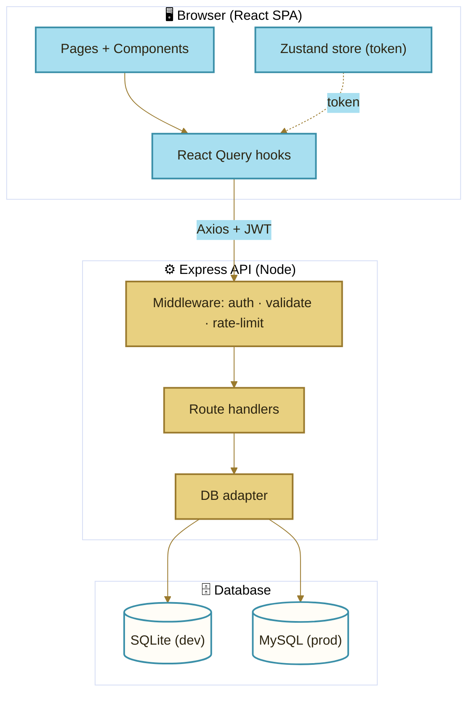
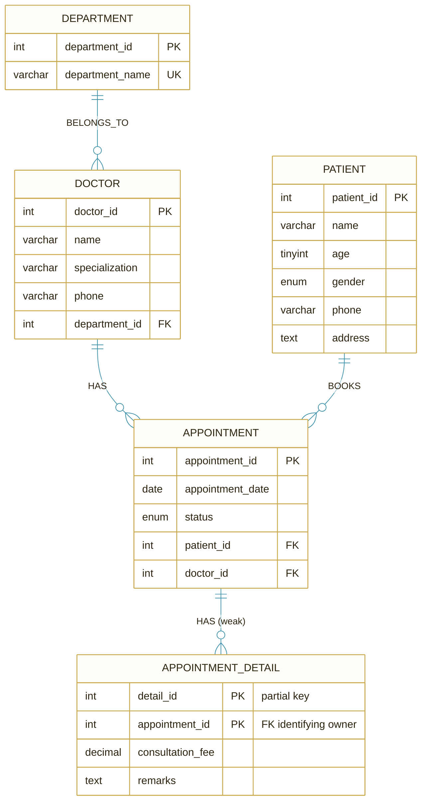
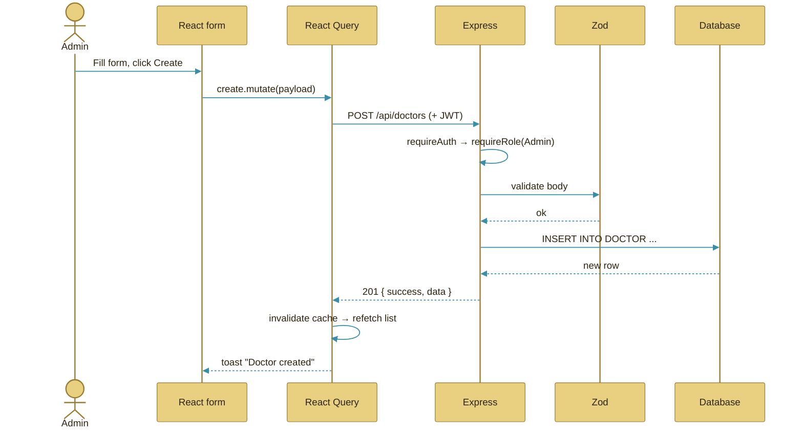
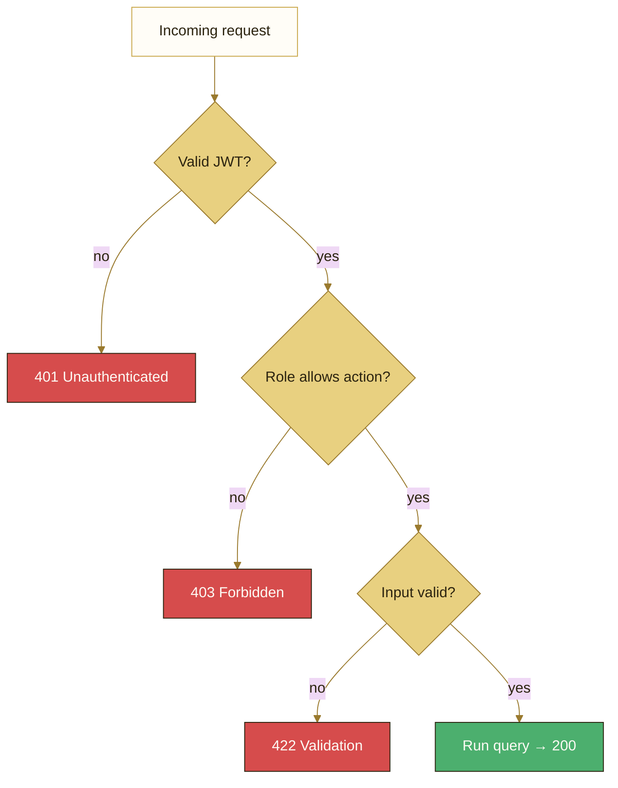

<div align="center">

# 🧠 MediVault HMS — Project Explanation

### *Everything about the project: what it is, what each part does, and why*

</div>

---

## Table of Contents

1. [What Is MediVault HMS?](#1-what-is-medivault-hms)
2. [Glossary of Terms](#2-glossary-of-terms)
3. [Technology Stack — and Why](#3-technology-stack--and-why)
4. [High-Level Architecture](#4-high-level-architecture)
5. [The Data Model (ER Schema) Explained](#5-the-data-model-er-schema-explained)
6. [Backend — File by File](#6-backend--file-by-file)
7. [Frontend — File by File](#7-frontend--file-by-file)
8. [Request Lifecycle (How a Click Becomes Data)](#8-request-lifecycle)
9. [The Dual-Database Design](#9-the-dual-database-design)
10. [Security & Roles](#10-security--roles)
11. [The Design System](#11-the-design-system)
12. [Testing](#12-testing)
13. [Scripts Reference](#13-scripts-reference)

---

## 1. What Is MediVault HMS?

**MediVault HMS** is a full-stack **Hospital Data Management System** — a web application that lets hospital administrators manage the core records of a hospital:

- **Departments** (e.g. Cardiology)
- **Doctors** (who belong to a department)
- **Patients**
- **Appointments** (a patient booking a doctor on a date)
- **Consultation Details** (the fee + remarks attached to an appointment)

It also includes a **SQL Console** for power users to query the database directly, and a **dashboard** with live charts.

It is built as a **monorepo**: a single repository containing two applications — a backend API and a frontend web app — that work together.

---

## 2. Glossary of Terms

| Term | Plain-English meaning |
|---|---|
| **Full-stack** | The project covers both the "front" (what you see in the browser) and the "back" (the server + database). |
| **Monorepo** | One Git repository holding multiple apps/packages (here: `apps/server` and `apps/web`). |
| **API** | *Application Programming Interface* — the backend's set of URLs the frontend calls to read/write data. |
| **REST** | A convention for designing APIs around resources and HTTP verbs (GET/POST/PUT/DELETE). |
| **CRUD** | *Create, Read, Update, Delete* — the four basic operations on a record. |
| **Endpoint** | A single API URL + method, e.g. `GET /api/doctors`. |
| **Schema** | The structure of the database — its tables and columns. |
| **DDL** | *Data Definition Language* — SQL that defines structure (`CREATE`, `ALTER`, `DROP`). |
| **DML** | *Data Manipulation Language* — SQL that changes data (`INSERT`, `UPDATE`, `DELETE`). |
| **Strong entity** | A table whose rows have their own identity (e.g. `PATIENT`). |
| **Weak entity** | A table whose rows only exist *because of* a parent row, and are partly identified by it — here `APPOINTMENT_DETAIL`. |
| **Primary Key (PK)** | The column(s) that uniquely identify a row. |
| **Partial key** | The part of a weak entity's key that's unique *only within* its parent (here `detail_id`). |
| **Foreign Key (FK)** | A column pointing to another table's primary key, enforcing a relationship. |
| **Cascade** | When deleting a parent automatically deletes its children (appointment → its details). |
| **JWT** | *JSON Web Token* — a signed token proving who you are, sent on every request after login. |
| **Hashing (bcrypt)** | One-way scrambling of passwords so they're never stored in plain text. |
| **ORM / Query builder** | A tool to talk to a database. Here we use **raw parameterized SQL** for clarity. |
| **SPA** | *Single-Page Application* — the browser loads one app and swaps views without full page reloads. |
| **Component** | A reusable piece of UI (a button, a card, a table). |
| **Hook** | A reusable piece of React logic (e.g. "fetch the list of doctors"). |
| **State management** | How the app remembers things (who's logged in, is the sidebar open). |

---

## 3. Technology Stack — and Why

### Backend
| Tech | What it is | Why it's here |
|---|---|---|
| **Node.js** | JavaScript runtime for servers | Same language as the frontend |
| **Express** | Minimal web framework | Defines the API routes simply |
| **better-sqlite3** | Embedded SQL database (file-based) | Zero-config local development |
| **mysql2** | MySQL driver | Production-grade database |
| **Zod** | Schema validation | Rejects bad input before it hits the DB |
| **jsonwebtoken** | Creates/verifies JWTs | Login + sessions |
| **bcryptjs** | Password hashing | Stores passwords safely |
| **express-rate-limit** | Throttles requests | Protects login + SQL console |

### Frontend
| Tech | What it is | Why it's here |
|---|---|---|
| **React 18** | UI library | Builds the interactive interface |
| **Vite** | Build tool / dev server | Instant hot-reload, fast builds |
| **TypeScript** | Typed JavaScript | Catches errors before runtime |
| **Tailwind CSS** | Utility-first styling | Rapid, consistent premium styling |
| **TanStack Query** | Server-state manager | Caching, loading/error states, refetching |
| **Zustand** | Client-state store | Holds auth token + UI flags |
| **React Router** | Routing | Page navigation in the SPA |
| **Recharts** | Charting library | Dashboard graphs |
| **Framer Motion** | Animation library | Spring-physics motion |
| **Phosphor Icons** | Icon set | Clean, light-line icons |
| **CodeMirror** | Code editor component | The SQL console editor |

---

## 4. High-Level Architecture



**In one sentence:** the React app calls the Express API over HTTP with a JWT; Express validates, checks your role, runs SQL through a database adapter, and returns JSON.

---

## 5. The Data Model (ER Schema) Explained



### How to read this
- **`DEPARTMENT ||--o{ DOCTOR`** — one department has many doctors; every doctor must belong to a department (**total participation**).
- **`DOCTOR / PATIENT ||--o{ APPOINTMENT`** — an appointment always links exactly one doctor and one patient.
- **`APPOINTMENT ||--o{ APPOINTMENT_DETAIL`** — the **weak** relationship. A detail row cannot exist without its appointment. Its primary key is **composite**: `(appointment_id, detail_id)`. The `detail_id` restarts at 1 for each appointment — that's the *partial key* behaviour.

### Foreign-key behaviour
| Relationship | On delete |
|---|---|
| Doctor → Department | `RESTRICT` (can't delete a department in use) |
| Appointment → Patient/Doctor | `RESTRICT` (can't delete a patient/doctor with appointments) |
| Detail → Appointment | `CASCADE` (delete an appointment ⇒ its details vanish) |

---

## 6. Backend — File by File

```
apps/server/src/
├── index.js                  → App entry: wires middleware + routes, boots the DB
├── db/
│   ├── connection.js         → THE dual-engine adapter (SQLite ⇄ MySQL)
│   ├── schema.mysql.sql      → MySQL table definitions (production)
│   ├── schema.sqlite.sql     → SQLite mirror (development)
│   ├── init.js               → Creates tables if missing + seeds sample data
│   └── seed.js               → Standalone `npm run seed` runner
├── middleware/
│   ├── auth.js               → signToken · requireAuth · requireRole
│   ├── validate.js           → Zod validation wrapper
│   ├── rateLimiter.js        → API / login / SQL-console limiters
│   └── error.js              → Turns DB errors into friendly messages
├── routes/
│   ├── auth.js               → POST /login · GET /me
│   ├── departments.js        → CRUD + doctor counts
│   ├── doctors.js            → CRUD + dept join + appt counts + history
│   ├── patients.js           → CRUD + appointment history
│   ├── appointments.js       → CRUD + /stats + nested /details (weak entity)
│   └── query.js              → /execute (guarded) + /schema
└── utils/
    └── http.js               → Response envelope, ApiError, pagination
```

### Key files in depth

**`db/connection.js`** — exposes a single async interface (`all`, `get`, `run`, `exec`, `raw`, `tableExists`). Internally it picks better-sqlite3 or mysql2 based on the `DB_CLIENT` env var. Because both engines accept `?` placeholders, **the route code never changes** between them.

**`middleware/error.js`** — catches every thrown error and maps database-specific failures (foreign-key violations, duplicates, check constraints) into clean, human-readable JSON like *"This record is still referenced by other records and cannot be removed."*

**`routes/appointments.js`** — the largest route. It builds the big multi-table JOIN, computes dashboard statistics (`/stats`), and manages the weak `APPOINTMENT_DETAIL` entity, generating `detail_id` per appointment via `MAX(detail_id)+1`.

**`routes/query.js`** — the SQL console backend. It **classifies** each statement (read / write / blocked) using keyword matching, blocks DDL for everyone, restricts DML to Admins, rejects multiple statements, and returns rows + columns + execution time.

---

## 7. Frontend — File by File

```
apps/web/src/
├── main.tsx                  → React entry, providers (Query, Router)
├── App.tsx                   → Route table + auth guard
├── index.css                 → Design tokens (the colour palette) + base styles
├── api/client.ts             → Axios instance: attaches JWT, normalizes errors
├── store/useAppStore.ts      → Zustand: token, user, sidebar state
├── lib/
│   ├── queryClient.ts        → React Query config
│   └── utils.ts              → cn(), currency(), formatDate(), downloadCsv()
├── types/index.ts            → All shared TypeScript types
├── hooks/
│   ├── useAuth.ts            → login mutation
│   ├── crud.ts               → factories: list / detail / create-update-delete
│   ├── useEntities.ts        → concrete hooks per entity + useStats()
│   ├── useDetails.ts         → weak-entity hooks
│   └── useSqlQuery.ts        → run query + fetch schema
├── layouts/
│   ├── DashboardLayout.tsx   → Sidebar + Topbar + page outlet
│   ├── Sidebar.tsx           → Desktop nav (collapsible)
│   ├── MobileNav.tsx         → Bottom nav for phones/tablets
│   └── Topbar.tsx            → Profile menu + sign out
├── components/
│   ├── ui/                   → Button · Card · Field · Badge · Modal · ConfirmDialog · Skeleton · Toaster
│   ├── shared/               → DataTable · StatCard · PageHeader · SearchInput · EmptyState · DetailsDrawer
│   └── charts/Charts.tsx     → Recharts wrappers (trend, revenue, donut)
└── pages/
    ├── Login.tsx · Dashboard.tsx · Departments.tsx · Doctors.tsx
    ├── Patients.tsx · Appointments.tsx · QueryConsole.tsx · NotFound.tsx
```

### Key concepts

**`hooks/crud.ts`** — to avoid repetition, this file contains *factory functions*. `makeListHook('doctors')` produces a ready-made "fetch doctors" hook; `makeMutations('doctors', 'Doctor')` produces create/update/delete hooks that auto-refresh the cache and show toasts. Each page just imports the ones it needs.

**`components/ui/Card.tsx`** — implements the **double-bezel** look: an outer "machined shell" wrapping an inner "core", giving cards a physical, premium feel.

**`components/shared/DataTable.tsx`** — the reusable table powering every CRUD page. It handles column rendering, client-side sorting, loading skeletons, empty states, and pagination.

**`components/shared/DetailsDrawer.tsx`** — the UI for the weak `APPOINTMENT_DETAIL` entity, opened from an appointment row.

---

## 8. Request Lifecycle

What happens when an Admin clicks **"Create"** on a new doctor:



If validation fails → `422`. If the role is too low → `403`. If a foreign key is missing → `400`. All surface as a red toast.

---

## 9. The Dual-Database Design

The single most important architectural decision. The same backend runs on two databases:

| | SQLite (dev) | MySQL (prod) |
|---|---|---|
| Setup | none — bundled file | Docker or local install |
| Config | `DB_CLIENT=sqlite` | `DB_CLIENT=mysql` |
| Driver | better-sqlite3 (sync) | mysql2 (async pool) |
| Use case | instant local dev, tests | production parity |

Both are wrapped by `connection.js` into one async API. Differences (`AUTO_INCREMENT` vs `AUTOINCREMENT`, `ENUM` vs `TEXT CHECK`) live only in the two schema files; **route code is identical**.

To switch to MySQL: `docker compose up -d`, then set `DB_CLIENT=mysql` in `apps/server/.env`.

---

## 10. Security & Roles



- **Passwords** are bcrypt-hashed (never stored in plain text).
- **JWT** expires after 8 hours; the frontend auto-logs-out on `401`.
- **Roles:** Admin (full), Doctor (edit appts/details), Viewer (read-only).
- **SQL console** whitelists `SELECT` for all; DML for Admin only; DDL blocked entirely.
- **Rate limits:** 300 req/min general, 30 req/min on the SQL console, 20 login attempts / 15 min.
- **Input** is validated with Zod on the backend (and the DB enforces constraints too).

---

## 11. The Design System

The look is **Cream × Gold × Sky-Blue**, defined as CSS variables in `apps/web/src/index.css`.

| Token | Hex | Role |
|---|---|---|
| `--surface-base` | `#FDFAF4` | Page background |
| `--surface-elevated` | `#FFFDF7` | Cards |
| `--gold-primary` | `#C9A84C` | Primary actions, borders |
| `--sky-primary` | `#5DB8D4` | Info, links, badges |
| `--text-primary` | `#2C2410` | Headings & body |
| `--status-success/error/warning` | green/red/amber | Status badges |

**Signature techniques:** double-bezel cards, pill buttons with nested trailing-icon "physics", staggered blur-fade entrances, an ambient cream→sky aura, and a subtle film-grain overlay. Headings use **Cormorant Garamond** (serif, for medical authority); body text uses **Plus Jakarta Sans**; the SQL console uses **JetBrains Mono**.

**Responsiveness:** multi-column grids collapse to single column under 768px, the sidebar becomes a floating bottom bar, tables scroll horizontally, and headings scale down — verified for phone, tablet, and laptop.

---

## 12. Testing

An end-to-end suite lives at `apps/server/test/smoke.mjs` (run with **`npm test`**). It spawns the server against a throwaway database and runs **52 assertions** covering auth, all CRUD, role gating, foreign-key guards, the weak entity (including cascade), and every SQL-console security rule.

```
52 passed, 0 failed
```

The frontend is verified with `npm run build` (TypeScript type-check + production bundle).

---

## 13. Scripts Reference

| Command | What it does |
|---|---|
| `npm install` | Install all workspace dependencies |
| `npm run dev` | Run API + web together with hot-reload |
| `npm run dev:server` | Run only the API |
| `npm run dev:web` | Run only the web app |
| `npm run build` | Production-build the frontend |
| `npm run seed` | (Re)seed the database |
| `npm test` | Run the API end-to-end test suite |
| `docker compose up -d` | Start MySQL 8 + Adminer for production parity |

---

<div align="center">

*MediVault HMS — Built with Precision. Designed with Taste.*

</div>
