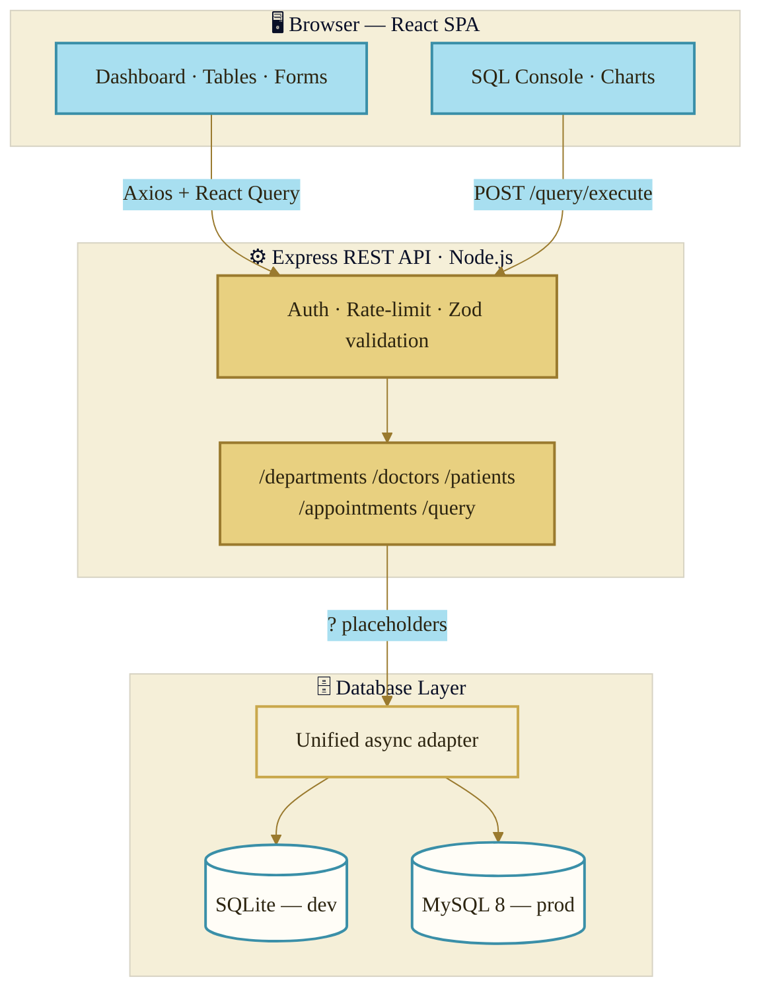
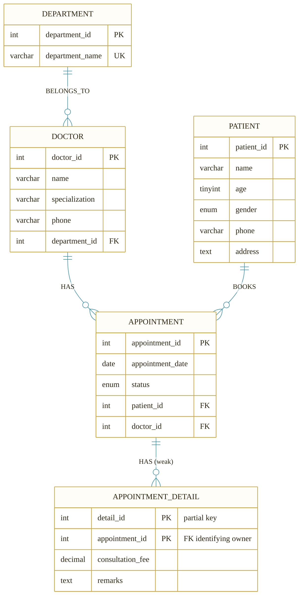
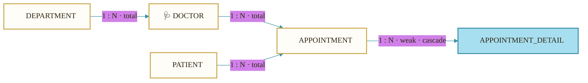
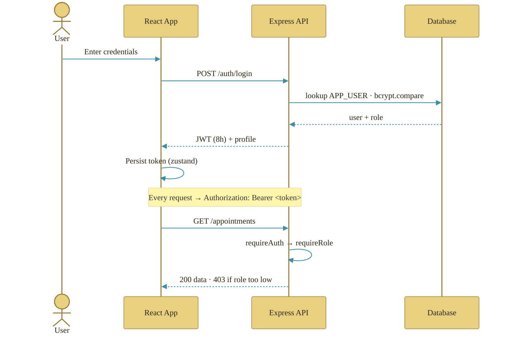
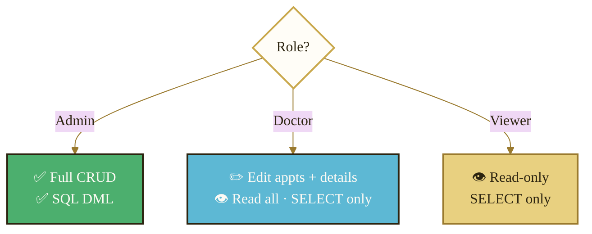
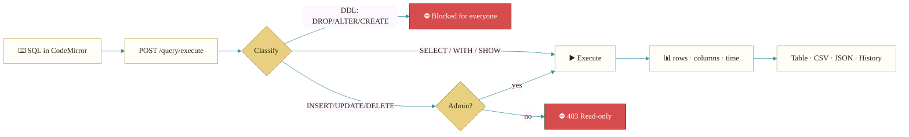

<div align="center">

# 🏥 MediVault HMS

### *Precision Care. Zero Chaos.*

A premium, full-stack **Hospital Data Management System** — Cream × Gold × Sky-Blue design language, a power-user SQL console, and a database layer that runs on **SQLite in dev** and **MySQL in production** from the *same* codebase.


</div>

---

## ✨ Highlights

| | |
|---|---|
| 🎨 **Premium UI** | Double-bezel cards, spring-physics motion, Cormorant Garamond display type, editorial film-grain texture |
| 🗄️ **Dual database** | Zero-config **SQLite** for instant local dev · **MySQL 8** for production — one query layer, two engines |
| 🔐 **JWT auth + roles** | Admin · Doctor · Viewer, with role-gated writes and a read-only SQL console for non-admins |
| 💻 **SQL Console** | CodeMirror editor, schema explorer, quick-query presets, CSV/JSON export, query history, statement guarding |
| 📊 **Live dashboard** | KPI cards, 14-day trend, revenue-by-department, status donut, recent bookings |
| 🧱 **Faithful ER schema** | Strong + **weak entity** (`APPOINTMENT_DETAIL`) modeled exactly per the PRD, with composite partial-key behavior |

---

## 🗺️ System Architecture



---

## 🧬 Entity-Relationship Diagram

> The canonical schema — `APPOINTMENT_DETAIL` is a **weak entity** identified by `APPOINTMENT` with a composite primary key `(appointment_id, detail_id)`.



### Relationship cardinality



---

## 🔐 Authentication & Role Flow



### Role → permission matrix



---

## 🧭 SQL Console Request Lifecycle



---

## 🚀 Quick Start

> **Prerequisites:** Node 18+ (works out-of-the-box on Node 24). No database install needed for dev — SQLite is bundled.

```bash
# 1) Install all workspaces
npm install

# 2) Configure the server (defaults are dev-ready)
cp apps/server/.env.example apps/server/.env

# 3) Run API + Web together (hot-reload both)
npm run dev
```

| Service | URL |
|---|---|
| 🌐 Web app | http://localhost:5173 |
| 🔌 API | http://localhost:3001/api |
| ❤️ Health | http://localhost:3001/api/health |

The database auto-creates and seeds on first launch.

### 🔑 Demo accounts (password: `medivault`)

| Role | Email | Can do |
|---|---|---|
| **Admin** | `admin@medivault.io` | Everything + SQL DML |
| **Doctor** | `doctor@medivault.io` | Edit appointments/details, read all |
| **Viewer** | `viewer@medivault.io` | Read-only |

---

## 🐬 Switching to MySQL (production parity)

```bash
# Spin up MySQL 8 + Adminer (schema auto-loads)
docker compose up -d

# Point the server at MySQL
#   apps/server/.env →  DB_CLIENT=mysql
npm run dev
```

Adminer (DB GUI) → http://localhost:8080 · server `mysql` · db `medivault_hms`.

The unified adapter in [`apps/server/src/db/connection.js`](apps/server/src/db/connection.js) speaks a single async API (`all` / `get` / `run` / `raw`) over both engines — route code never changes.

---

## 🧱 Project Structure

```text
medivault-hms/
├── apps/
│   ├── server/                 # Express REST API
│   │   └── src/
│   │       ├── db/             # connection.js · schema.*.sql · init · seed
│   │       ├── middleware/     # auth · validate · rateLimiter · error
│   │       ├── routes/         # departments · doctors · patients · appointments · query · auth
│   │       ├── utils/          # http envelope helpers
│   │       └── index.js        # app entry
│   └── web/                    # React + Vite + Tailwind SPA
│       └── src/
│           ├── components/     # ui/ · shared/ · charts/
│           ├── hooks/          # React Query data hooks
│           ├── layouts/        # Sidebar · Topbar · DashboardLayout
│           ├── pages/          # Dashboard · CRUD · QueryConsole · Login
│           ├── store/          # zustand (auth + ui)
│           └── types/          # shared TS types
├── docker-compose.yml          # MySQL 8 + Adminer
└── package.json                # npm workspaces
```

---

## 🛠️ Tech Stack

**Frontend:** React 18 · Vite · TypeScript · Tailwind CSS · TanStack Query · Zustand · Framer Motion · Recharts · Phosphor Icons · CodeMirror
**Backend:** Node.js · Express · Zod · JWT · bcryptjs · express-rate-limit
**Database:** better-sqlite3 (dev) · mysql2 (prod)

---

## 📡 API Reference

All responses use a standard envelope: `{ success, data, meta? }` or `{ success: false, error }`.

| Resource | Endpoints |
|---|---|
| **Auth** | `POST /auth/login` · `GET /auth/me` |
| **Departments** | `GET/POST /departments` · `GET/PUT/DELETE /departments/:id` |
| **Doctors** | `GET/POST /doctors` · `GET/PUT/DELETE /doctors/:id` |
| **Patients** | `GET/POST /patients` · `GET/PUT/DELETE /patients/:id` |
| **Appointments** | `GET/POST /appointments` · `GET/PUT/DELETE /appointments/:id` · `GET /appointments/stats` |
| **Details (weak)** | `GET/POST /appointments/:id/details` · `PUT/DELETE /appointments/:id/details/:detailId` |
| **SQL Console** | `POST /query/execute` · `GET /query/schema` |

List endpoints accept `?page`, `?limit`, `?search`, `?status`, `?department_id`, `?date_from`, `?date_to`, `?sort`, `?order`.

---

## 🎨 Design System

The Cream × Gold × Sky-Blue palette is enforced via CSS variables in [`apps/web/src/index.css`](apps/web/src/index.css).

| Token | Hex | Use |
|---|---|---|
| `--surface-base` | `#FDFAF4` | Page background |
| `--gold-primary` | `#C9A84C` | Primary CTA / borders |
| `--sky-primary` | `#5DB8D4` | Info / links / badges |
| `--text-primary` | `#2C2410` | Headings & body |

Cards use a **double-bezel** (machined outer shell + inner core), buttons are pills with nested trailing-icon physics, and every list animates in with a staggered blur-fade.

---

<div align="center">

*MediVault HMS — Built with Precision. Designed with Taste.*
**RVCE CSE · 2026**

</div>
