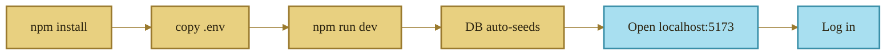
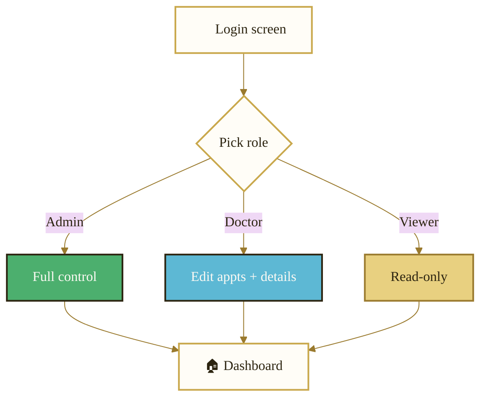
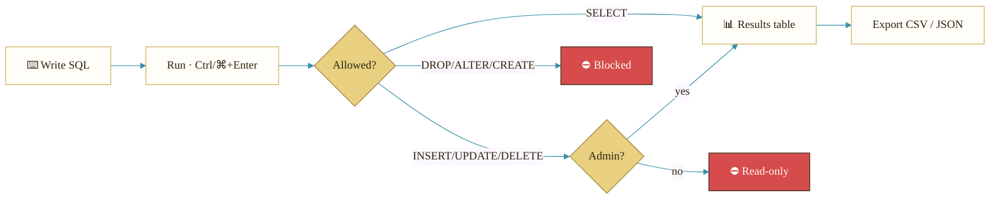

<div align="center">

# 📖 MediVault HMS — User Manual

### *A step-by-step guide to using the Hospital Data Management System*

</div>

---

## Table of Contents

1. [Getting Started](#1-getting-started)
2. [Logging In & Roles](#2-logging-in--roles)
3. [Navigating the App](#3-navigating-the-app)
4. [The Dashboard](#4-the-dashboard)
5. [Managing Departments](#5-managing-departments)
6. [Managing Doctors](#6-managing-doctors)
7. [Managing Patients](#7-managing-patients)
8. [Managing Appointments](#8-managing-appointments)
9. [Consultation Details (Weak Entity)](#9-consultation-details)
10. [The SQL Console](#10-the-sql-console)
11. [Exporting Data](#11-exporting-data)
12. [Common Workflows](#12-common-workflows)
13. [Troubleshooting](#13-troubleshooting)

---

## 1. Getting Started

### Prerequisites
- **Node.js 18+** (tested on Node 24)
- No database install needed for local use — SQLite is bundled.

### Launch
```bash
npm install                              # one time
cp apps/server/.env.example apps/server/.env
npm run dev                              # starts API + web together
```

| What | Where |
|---|---|
| 🌐 Open the app | http://localhost:5173 |
| 🔌 API base | http://localhost:3001/api |

The database **auto-creates and seeds** itself the first time you start the server.



---

## 2. Logging In & Roles

On the login screen, click a **demo chip** (Admin / Doctor / Viewer) to auto-fill, then **Sign in**. All demo passwords are `medivault`.

| Role | Email | What you can do |
|---|---|---|
| 👑 **Admin** | `admin@medivault.io` | Everything — full CRUD + run write-queries in the SQL console |
| 🩺 **Doctor** | `doctor@medivault.io` | Read everything · edit appointments & consultation details |
| 👁️ **Viewer** | `viewer@medivault.io` | Read-only · run `SELECT` queries |



> **Sign out** any time from the avatar menu in the top-right corner.

---

## 3. Navigating the App

- **Desktop:** a collapsible **left sidebar** holds all sections. Click the chevron at the bottom to collapse it to icons.
- **Mobile / tablet:** the sidebar is replaced by a floating **bottom navigation bar**.
- The **top bar** shows your profile and the sign-out menu.

| Icon | Section | Purpose |
|---|---|---|
| ▦ | Dashboard | KPIs and charts |
| 🏢 | Departments | Clinical departments |
| 🩺 | Doctors | Clinicians |
| 👥 | Patients | Patient records |
| 📅 | Appointments | Bookings + billing |
| ▶ | SQL Console | Direct database queries |

---

## 4. The Dashboard

The landing page after login. It shows, in real time:

- **KPI cards** — total departments, doctors, patients, and today's appointments.
- **Revenue (month-to-date)** and the **status distribution** donut.
- **Appointments trend** (last 14 days) and **revenue by department**.
- **Recent appointments** table (latest 5 bookings).

All figures refresh automatically after you create or edit records.

---

## 5. Managing Departments

> **Write actions require the Admin role.**

| Action | How |
|---|---|
| **Search** | Type in the search box (filters as you type) |
| **Add** | Click **New Department** → enter a unique name → **Create** |
| **Edit** | Click the ✏️ pencil on a row → change the name → **Save changes** |
| **Delete** | Click the 🗑️ trash → confirm. *Blocked if doctors are still assigned (you'll get a friendly error).* |

---

## 6. Managing Doctors

| Action | How |
|---|---|
| **Filter** | Use the **department dropdown** + search box (name or specialization) |
| **Add** | **New Doctor** → fill name, specialization, phone (10–15 digits), department → **Create** |
| **Edit / Delete** | Pencil / trash icons on each row. Deletion is blocked if the doctor has appointments. |

The **Appts** badge shows how many appointments each doctor has.

---

## 7. Managing Patients

| Action | How |
|---|---|
| **Filter** | Search by name, or use the **gender chips** (All / Male / Female / Other) |
| **Add** | **New Patient** → name, age (1–149), gender, phone, optional address → **Create** |
| **Edit / Delete** | Pencil / trash icons. Deletion is blocked if the patient has appointments. |
| **Export** | **Export CSV** downloads the current list |

---

## 8. Managing Appointments

```mermaid
%%{init: {'theme':'base','themeVariables':{'primaryColor':'#FFFDF7','primaryTextColor':'#2C2410','primaryBorderColor':'#C9A84C','lineColor':'#3A8FA8','fontFamily':'Plus Jakarta Sans'}}}%%
flowchart LR
    N["➕ Book Appointment"] --> S["Select patient + doctor"]
    S --> AUTO["Department auto-fills<br/>from doctor"]
    AUTO --> DT["Pick date + status"]
    DT --> SAVE["Save → appears in list"]
    SAVE --> R["🧾 Add consultation details"]
    classDef s fill:#E8D080,stroke:#9A7A2E,color:#2C2410,stroke-width:2px;
    classDef e fill:#A8DFF0,stroke:#3A8FA8,color:#2C2410,stroke-width:2px;
    class N,S,AUTO,DT s; class SAVE,R e;
```



| Action | Who | How |
|---|---|---|
| **Filter by status** | all | Status chips: All / Scheduled / Completed / Cancelled / No-Show |
| **Filter by date** | all | Use the **From → To** date pickers; **Clear** resets them |
| **Book** | Admin | **Book Appointment** → choose patient & doctor (department auto-shows) → date + status |
| **Edit status / reschedule** | Admin, Doctor | Pencil icon on a row |
| **Delete** | Admin | Trash icon — *also removes that appointment's consultation details (cascade)* |
| **View / bill** | all (edit: Admin/Doctor) | 🧾 receipt icon → opens consultation details |

---

## 9. Consultation Details

`APPOINTMENT_DETAIL` is a **weak entity** — each record belongs to one appointment and its `detail_id` is numbered **per appointment** (1, 2, 3 …), generated by the server.

1. On the Appointments page, click the **🧾 receipt icon** on a row.
2. The drawer lists all consultation details and the **total billed**.
3. **Add detail** → enter a consultation fee (≥ 0) and optional remarks.
4. Edit or remove any detail with the pencil / trash icons.

> A small blue badge on the receipt icon shows how many details an appointment already has.

---

## 10. The SQL Console



| Feature | How |
|---|---|
| **Quick queries** | Click a preset chip (e.g. *Revenue by Department*) to load ready-made SQL |
| **Run** | Click **Run** or press **Ctrl/⌘ + Enter** |
| **Schema explorer** | Right panel — expand a table, click a column name to insert it |
| **History** | Your last 10 queries (stored locally) — click to reload |
| **Export** | **CSV** / **JSON** buttons on the results header |

**Safety rules:** `DROP`, `ALTER`, `CREATE`, `TRUNCATE` are **always blocked**. Only Admins may run `INSERT/UPDATE/DELETE`. Multiple statements at once are rejected.

---

## 11. Exporting Data

| From | Button | Output |
|---|---|---|
| Patients page | **Export CSV** | The current patient list |
| SQL Console | **CSV** / **JSON** | The current query result set |

Files download straight to your browser's downloads folder.

---

## 12. Common Workflows

**Book a complete visit, end to end:**
1. **Patients** → add the patient (if new).
2. **Doctors** → confirm the doctor exists in the right department.
3. **Appointments** → **Book Appointment** → pick patient + doctor + date.
4. On that appointment's row → **🧾 receipt** → **Add detail** → enter the fee.
5. Back on the **Dashboard**, revenue and the trend chart update automatically.

**Pull a revenue report:**
- **SQL Console** → preset **Revenue by Department** → **Run** → **Export CSV**.

---

## 13. Troubleshooting

| Symptom | Fix |
|---|---|
| "Network error — is the API running?" | Make sure `npm run dev` is running (the API on port 3001). |
| Can't add/edit/delete | You're likely signed in as **Viewer** or **Doctor**. Sign in as **Admin**. |
| "Cannot be removed…" on delete | A foreign-key guard — remove dependent records first (e.g. a department's doctors). |
| Mermaid diagrams show as code in VS Code | Install the **Markdown Preview Mermaid Support** extension, or view the file on GitHub (renders natively). |
| Want to start fresh | Delete `apps/server/data/` and restart — it re-seeds. |

---

<div align="center">

*MediVault HMS — Precision Care. Zero Chaos.*

</div>
